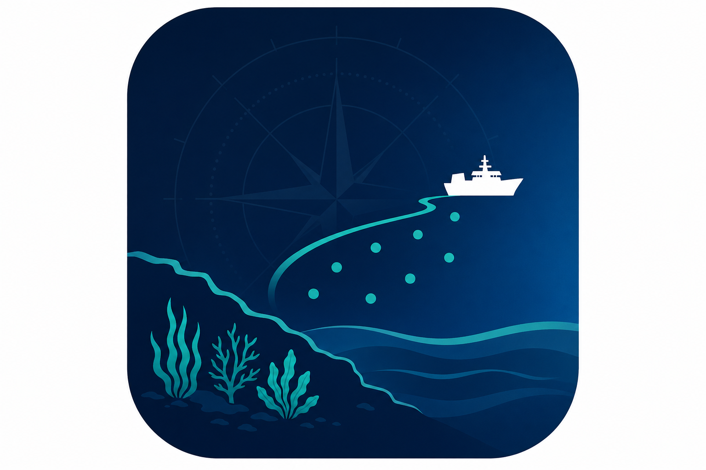

  # 관제 시스템

  This is a code bundle for 관제 시스템. The original project is available at https://www.figma.com/design/mYLNUYz16NhW4yoCF5W4Nv/%EA%B4%80%EC%A0%9C-%EC%8B%9C%EC%8A%A4%ED%85%9C.

  ## 시연 접속 주소

  - **내부망·LAN 시연:** `http://192.168.45.214:5111/` (개발 서버를 해당 호스트·포트로 띄울 때)
  - **공개 배포 시연:** [https://marine-seeding-control-git-main-pwping83-webs-projects.vercel.app/](https://marine-seeding-control-git-main-pwping83-webs-projects.vercel.app/)

  이전 미리보기 주소(`marine-seeding-control-brcqjevvx-…`)는 Vercel에서 Deployment 삭제·`vercel.json` 리다이렉트로 정리합니다.

  ## 주요 기능 (요약)

  - **실시간 관제**: Leaflet 지도, 항적·살포점, (선택) LTE 궤적
  - **AI 기상 안전**: 기상청 API(선택) + 8시간 예보·지도 하단 **반투명 타임라인**, 사이드바·타임라인 **표시 등급 통합**(긴급 임계+첫 슬롯 보수적 합성), **AI기상 위험 상황 자동 요약 리포트**(Groq 등, 선택)
  - **작업 계획**: 단기 합성 7일 카드 + (선택) **중기예보** 보강, 금일 **항적·보고 모달**(CSV·PDF), 살포점 **구역 추정 면적(ha)**
  - **긴급·IoT**: 관제→선박 명령, SOS 시연, Supabase 연동(선택)
  - **항로·속도**: A* 회피 경로, PID·목표 속도, **항상 펼친** 네비 패널
  - **AI 살포 계획**: 작업 계획 탭 좌측 — 일일 한도, 해역 추천, PID 스케치
  - **고도화 모달**: 무인화 1~3단계 계획(관공서용) + **개발 예정**: 암초 센서·지도 기록·공유 레이어·항로 자동 회피(기획, 모달 **암초·회피** 탭)

  상세: `docs/제품-운영/해양-종자-살포-관제-시스템-개요.md`(「기능 개발 예정」), `docs/제품-운영/사용자매뉴얼_v1.5.md` · 문서 책장·폴더 구조 `docs/README.md`

  ## Running the code

  Run `npm i` to install the dependencies.

  Run `npm run dev` to start the development server.
  