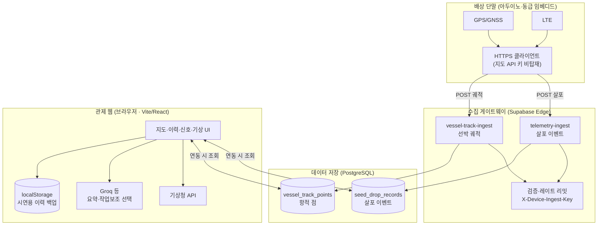

# 시스템 아키텍처 구조도 (관공서·심사 제출용)

본 문서는 **해양 종자 살포 관제** 저장소 구현을 기준으로, **단말 → 수집 게이트웨이 → DB → 관제 웹** 흐름과 **시연용 로컬 저장**을 한눈에 보여 줍니다.  
세부 보안·원칙은 [`관공서_설명용_해상종자살포_단말·연동요약.md`](./관공서_설명용_해상종자살포_단말·연동요약.md)를 참고하세요.

---

## 1. PNG 이미지 (인쇄·첨부용)

아래 파일을 그대로 제출 PDF에 삽입하거나 별도 첨부할 수 있습니다.

- **`시스템_아키텍처_구조도.png`** (이 문서와 같은 폴더 `docs/`)

원본 다이어그램 소스(Mermaid)는 수정·재출력 시 사용합니다.

- **`시스템_아키텍처_구조도.mmd`**

PNG를 다시 만들 때(로컬):

```bash
cd 관공서-제출용/docs
npx --yes @mermaid-js/mermaid-cli -i 시스템_아키텍처_구조도.mmd -o 시스템_아키텍처_구조도.png -b white -w 1200
```

---

## 2. 동일 내용 — Mermaid (GitHub·일부 뷰어에서 렌더)



---

## 3. 범례 (심사 질문용 한 줄)

| 구간 | 설명 |
|------|------|
| 단말→Edge | **HTTPS**만 사용, **살포**와 **궤적** 채널·테이블 분리 |
| Edge→DB | 서비스 롤은 Edge 내부, 단말은 **anon 직접 INSERT 없음** |
| 관제 웹 | Supabase **미연동 시**에도 **localStorage**로 살포 이력 시연 가능 |
| 기상·Groq | 브라우저에서 **기상청 API**·선택적 **LLM 요약** 호출(운영 정책에 맞게 키 관리) |

---

*문서 끝*
